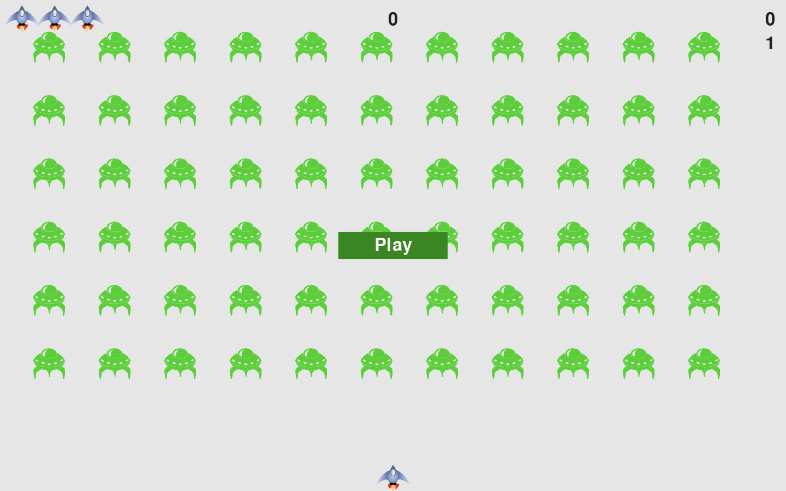

# Alien Invasion Game

A thrilling 2D space shooter built with Python and Pygame. Pilot your ship, fend off alien waves, rack up points—and survive as long as you can!

## 🚀 Table of Contents

- [Game Overview](#game-overview)
- [Features](#features)
- [Screenshots](#screenshots)
- [Getting Started](#getting-started)
  - [Prerequisites](#prerequisites)
  - [Installation](#installation)
  - [Running the Game](#running-the-game)
- [Controls](#controls)
- [Code Structure](#code-structure)
- [How It Works](#how-it-works)
- [Future Enhancements](#future-enhancements)
- [Contributing](#contributing)
- [License](#license)

## Game Overview

Welcome to **Alien Invasion Game**—a classic arcade-style shooter inspired by the *Python Crash Course*. Fight off endless waves of aliens, level up, and defend your spaceship!

## Features

- **Dynamic difficulty**: Each level increases alien speed and count
- **Scoring system**: Track current score, high score, and level
- **Lives system**: Start with multiple ships; game ends after losing all
- **Clean graphics**: Simple sprites for smooth gameplay
- **Designed with OOP**: Modular code for ship, bullets, aliens, etc.

## Screenshots



## Getting Started

### Prerequisites

- Python 3.6+
- Pygame library

### Installation

```bash
git clone https://github.com/Adheesh49/Alien-Invasion-Game.git
cd Alien-Invasion-Game
pip install pygame
```

### Running the Game

```bash
python3 alien_invasion.py 
```

## Controls

| Action | Keys |
|--------|------|
| Move Left | ← (Left Arrow) |
| Move Right | → (Right Arrow) |
| Shoot Bullet | Spacebar |
| Quit Game | Q |

## Code Structure

```
Alien-Invasion-Game/
├── alien.py          # Alien class & behavior
├── ship.py           # Player ship with movement & collision
├── bullet.py         # Bullet creation and movement
├── game_stats.py     # Tracks scores, levels, lives
├── scoreboard.py     # Displays game info on screen
├── settings.py       # Screen, speed, and color settings
├── button.py         # Start/play button functionality
└── alien_invasion.py # Main game loop & event handling
```

## How It Works

1. **Initialization**: Load game settings, window, sprites
2. **Main loop**:
   - Handle player input
   - Update positions: ship, bullets, aliens
   - Detect collisions: bullet-alien, alien-ship, alien-bottom
   - Refresh screen & display stats
3. **Progression**: Clear wave → next level spawns faster aliens
4. **Game Over**: Lose all lives → stop & optionally restart

## Future Enhancements

- **🎁 Power-ups**: Shields, rapid-fire, multi-bullets
- **🌟 Boss levels**: Introduce enemy types with unique behaviors
- **👥 Multiplayer mode**: Co-op or competitive play
- **🎨 UI polish**: Menus, sound FX, and animations

## Contributing

Love the game? Want to help?

1. Fork the repo
2. Create a feature branch (`git checkout -b feature-awesome`)
3. Commit your enhancements
4. Push to your fork
5. Open a Pull Request

## License

This project is open source. License details to be added.